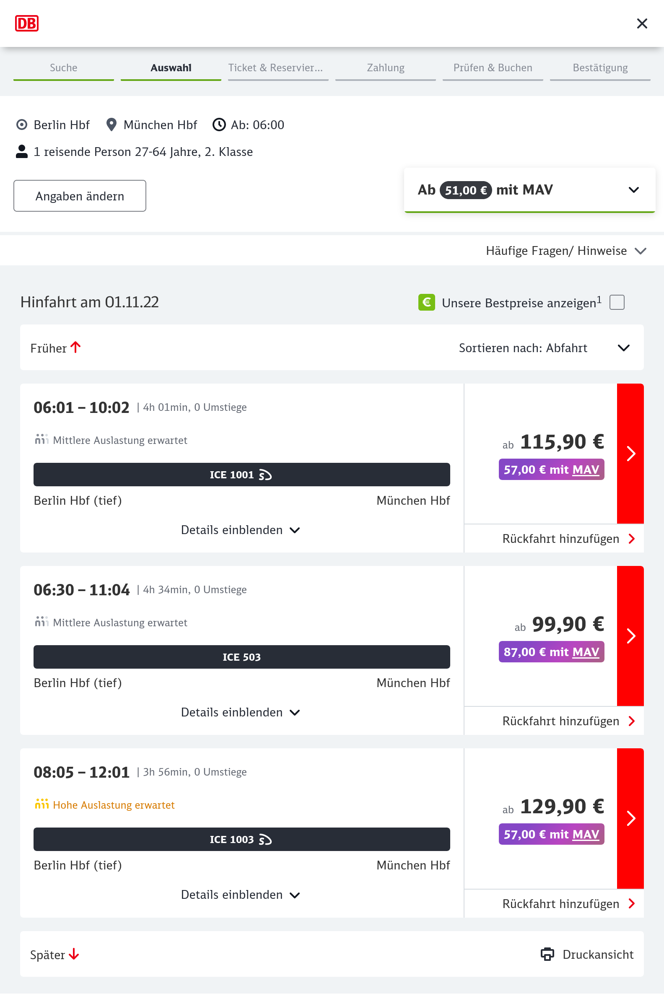

:warning: Very unstable (and probably broken) code. Not ready.

"Works" in Firefox 🦊. Not tested in other browsers.

## What is this?

This is a browser extension that allows you to save money on [bahn.de](https://bahn.de) by automatically searching other providers (currently only [MÁV](https://mavcsoport.hu)) for cheaper tickets.

## What will this be?

Hopefully a browser extension that automatically tries and applies various price tricks.

## Screenshot

